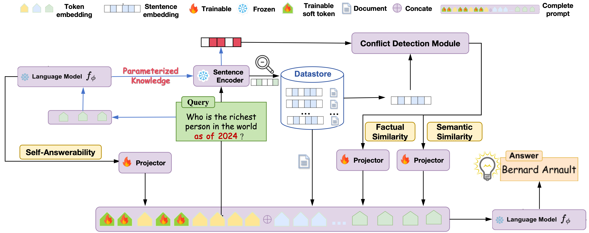

# TCR: Transparent Conflict Resolution in RAG

> **Paper**: [Seeing through the Conflict: Transparent Knowledge Conflict Handling in Retrieval-Augmented Generation](https://arxiv.org/abs/2405.13792) — AAAI 2026 Oral

<div align=center>

</div>

---

## Quick Start

```bash
# 1. Install dependencies
pip install -r requirements.txt

# 2. Configure environment
cp .env.example .env
# Edit .env and add your HF_TOKEN

# 3. Prepare training data (Stage 3)
python tcr_e2e/generate_squad_context.py --n 1000 --api_key sk-xxx --base_url https://xxx
python tcr_e2e/prepare.py --n 1000 --hf_token hf_xxx

# 4. Train end-to-end
python tcr_e2e/train.py --epochs 10 --batch_size 2 --hf_token hf_xxx

# 5. Evaluate
python tcr_e2e/eval.py --data tcr_e2e/data/test.jsonl --checkpoint tcr_e2e/outputs/tcr_final.pt --hf_token hf_xxx
```

## Pretraining (Optional)

TCR trains in three stages. If you want to pretrain Stage 1 & 2 from scratch:

### Stage 1: Dual Encoder

```bash
bash scripts/train_stage1.sh --batch_size 64 --lr 1e-4 --epochs 5
```

### Stage 2: Answerability MLP

```bash
bash scripts/train_stage2.sh --batch_size 64 --lr 1e-4 --epochs 15
```

Checkpoints are saved to `checkpoints/`.

## Data Format

**Training data** (`tcr_training_data.jsonl`):
```json
{"question": "...", "golden_answer": "...", "context_type": "golden", "sigma_sem": 0.9, "sigma_fact": 0.8, "sigma_ans": 0.7, ...}
```

**Test data** (single context):
```json
{"question": "...", "answer": "...", "context": "..."}
```

## Citation

```bibtex
@article{ye2026tcr,
  title={Seeing through the Conflict: Transparent Knowledge Conflict Handling in Retrieval-Augmented Generation},
  author={Ye, Hua and Chen, Siyuan and Zhong, Ziqi and Xiao, Canran and Zhang, Haoliang and Wu, Yuhan and Shen, Fei},
  booktitle={AAAI Conference on Artificial Intelligence (AAAI 2026 Oral)},
  year={2026}
}
```
